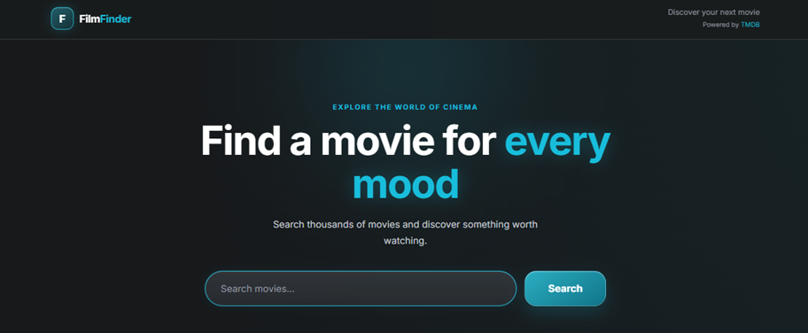
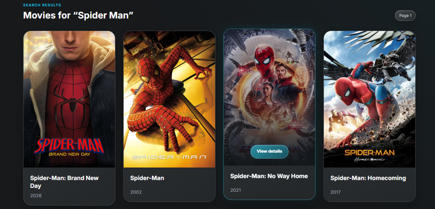

# 🎬 FilmFinder

### Home Page

  

A modern, fully responsive movie discovery web application built with **React**, **TypeScript**, and **Vite**. Search for movies, browse results, and view detailed information through a clean, modern interface powered by the **TMDB API**.

## 🌐 Live Demo

👉 **https://my-film-finder.netlify.app/**

### Search Results

  

## ✨ Features

- 🔍 Search movies by title
- 🎞️ Browse search results
- 📄 View detailed movie information
- ⭐ Display movie ratings and release year
- 📱 Fully responsive design
- 🎨 Modern glassmorphism UI
- ⏳ Loading and error states
- ♿ Accessible modal with keyboard support

## 🛠 Tech Stack

- React
- TypeScript
- Vite
- TanStack React Query
- Axios
- CSS Modules
- React Paginate
- TMDB API

## 💡 What I Learned

During this project I practiced:

- Building scalable React applications with TypeScript
- Working with external REST APIs
- Managing server state using React Query
- Creating reusable React components
- Implementing responsive layouts
- Improving accessibility and user experience
- Organizing clean and maintainable project structure

## 📁 Repository

👉 **https://github.com/JenyaLinx/FilmFinder**

---

## 👩‍💻 Author

**Yevhenii Oliinyk**

GitHub: https://github.com/JenyaLinx

LinkedIn: https://www.linkedin.com/in/yevhenii-oliinykk

---

⭐ If you like this project, feel free to give it a star!
